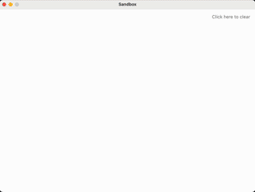

# Sandbox: Falling Sand Simulation in Kotlin Compose for Desktop

This project demonstrates a simple falling sands simulation built with Kotlin and Jetpack Compose for Desktop.

Features:

* Sand particles fall under gravity.
* Particles interact with each other and the bottom boundary, creating a dynamic simulation.
* Colours!



## Getting Started

Prerequisites:

* A recent version of IntelliJ IDEA Community
* JDK 17 or later (JetBrains Runtime **strongly** recommended)
* Kotlin compiler (included with most recent IntelliJ IDEA versions)

## Running the application

1. Open the project in your favorite IDE (e.g. IntelliJ IDEA).
2. Build and run the project. The simulation should launch.

## Licence

This project is licenced under the Apache Licence, Version 2.0. See the [licence file](LICENSE) for details.

```
Copyright 2024 Sebastiano Poggi
Licensed under the Apache License, Version 2.0 (the "License");
you may not use this file except in compliance with the License.
You may obtain a copy of the License at
    http://www.apache.org/licenses/LICENSE-2.0
Unless required by applicable law or agreed to in writing, software
distributed under the License is distributed on an "AS IS" BASIS,
WITHOUT WARRANTIES OR CONDITIONS OF ANY KIND, either express or implied.
See the License for the specific language governing permissions and
limitations under the License.
```

## Contributing

The code for this project is decent, but not great. There is a ton of performance optimisation that can be done, if you
feel so inclined. I haven't really bothered too much. It's plenty fast on my Macbook.

We welcome contributions to this project. Please see the [CONTRIBUTING.md](CONTRIBUTING.md) file for guidelines.

## Disclaimer

This is a sample project for demonstration purposes only. It may not be production-ready and is intended to showcase the
capabilities of Kotlin Compose for Desktop.
